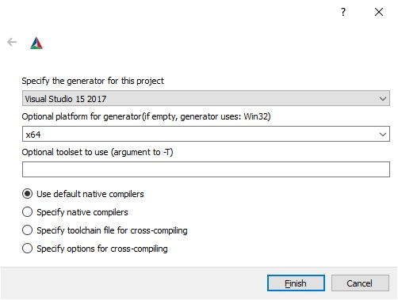

# Stereolabs ZED - C# Wrapper

This repository shows how to use the ZED SDK functionalities in C#.

## Getting started

- First, download the latest version of the ZED SDK on [stereolabs.com](https://www.stereolabs.com/developers/release/).
- For more information, read the ZED [API documentation](https://www.stereolabs.com/docs/api/index.html).

## Prerequisites

- Windows 10 64bits or later
- Visual Studio 2017 with C# extensions
- Cmake 3.8 at least (Support of C#)
- [ZED SDK](https://www.stereolabs.com/developers/release/) and its dependency ([CUDA](https://developer.nvidia.com/cuda-downloads))

## Instructions

The C++ to C# is done the following way : 
- A C interface to the ZED SDK is provided in the Resources folder (sl_zed_interface.dll)
- A .NET wrapper Stereolabs.zed that import the function from the dll interface (must be built) 
- You can then use the functions of the .NET wrapper in your program.

### Build for .NET Wrapper
Enter the Stereolabs.zed folder and generate the VS solution using cmake.
Use Visual studio 2017 (at least) compiler in x64 mode. 

Press configure and generate.

Open Stereolabs.zed.sln solution and build the solution. 
Make sure to build INSTALL so that both sl_zed_interface.dll and Stereolabs.zed.dll are copied into the ZED_SDK_ROOT_DIR/bin folder (usually C:/Program Files(x86)/ZED SDK/bin/). You might need admin rights to do that.

### Build the tutorials
Enter the tutorials folder and generate the Tutorials solution using cmake. 
Use the same settings at the .NET wrapper. (x64/ VS2017)

Open Tutorials.sln solution and build it. 

### Deployment
When the program is built, Stereolabs.zed.dll will be automatically copied into the build folder, because it is DoNet dependency. 
When deploying the application, make sure that sl_zed_interface.dll is packaged with the executable files, and shipped on a target PC that has the proper ZED SDK version installed. 
 
